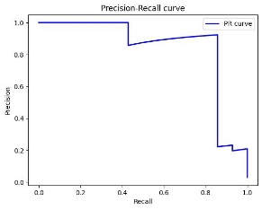

**Clinical Text Classification** 

**Emre YAPICI – 201805107 Yiğit ÇAKMAK – 201805106 Sahra Nur PAKEL – 201805078** 

1) **Introduction** 

This project aims to classify medical text from medical transcriptions using advanced transformer models specifically adapted for clinical text. We utilize ClinicalBERT and Bio\_ClinicalBERT, as well as a customized lightweight version of ClinicalBERT, to perform clinical text classification. The evaluation metrics include confusion matrix, accuracy, precision, recall, F1-score, Area Under the Curve (AUC), and Precision-Recall (PR) curves. 

2) **Data Review** 

The dataset used for this project is the Medical Transcriptions dataset available on Kaggle. This dataset contains various medical transcriptions categorized into different medical specialties. 

Dataset link:[ Medical Transcriptions ](https://www.kaggle.com/datasets/tboyle10/medicaltranscriptions/data)

The data set was examined, missing values in the text column were cleared and grouped according to medical characteristics. Word statistics were obtained. After examining the number of categories, categories with more than 50 numbers were determined. 

A chart has been created showing the distribution of more than 50 categories. 

Two sample transcripts selected before data preprocessing are shown. 

 

3) **Data Preprocessing** 

Text cleaning and lemmatization processes were carried out to better analyze and classify the text data of the project. The text data went through basic preprocessing steps and was prepared for classification. And finally, in this section, the metrics to be used to evaluate the classification models are defined. 

Two sample transcripts selected after data preprocessing are shown. 

4) **Models** 

We implemented three different models for clinical text classification: 

1. ClinicalBERT 
   1. Model link:[ ClinicalBERT ](https://huggingface.co/medicalai/ClinicalBERT)
1. Bio\_ClinicalBERT 
   1. Model link:[ Bio_ClinicalBERT ](https://huggingface.co/emilyalsentzer/Bio_ClinicalBERT)
1. Customized Lightweight ClinicalBERT 
- We chose one of the three versions provided in the literature: 
  - [Distil-ClinicalBERT ](https://huggingface.co/nlpie/distil-clinicalbert)
  - [Tiny-ClinicalBERT ](https://huggingface.co/nlpie/tiny-clinicalbert)
  - [Clinical-MiniALBERT-312 ](https://huggingface.co/nlpie/clinical-miniALBERT-312)

For the purpose of this project, we used the **Distil-ClinicalBERT** version. 

5) **Methodology** 

The implementation follows the clinical text classification approach detailed in the Kaggle notebook by Rithesh Sreenivasan. The methodology involves: 

1. Preprocessing the medical text data. 
1. Adapting the ClinicalBERT and Bio\_ClinicalBERT models to classify the text. 
1. Training and evaluating the models using standard evaluation metrics. 
1. Comparing the performance of the three models. 

Implementation reference:[ Clinical Text Classification ](https://www.kaggle.com/code/ritheshsreenivasan/clinical-text-classification)

6) **Evaluation Metrics** 

The performance of the models was evaluated using the following metrics: 

- Confusion Matrix 
- Accuracy 
- Precision 
- Recall 
- F1-Score 
- AUC (Area Under the Curve) 
- PR (Precision-Recall) Curves 
7) **Results** 

**Confusion Matrix** 

ClinicalBERT

Distil-ClinicalBERT

**Accuracy** 

|**Model** |**Accuracy** |
| - | - |
|ClinicalBERT |0\.3913978494623656|
|Bio\_ClinicalBERT |0\.6752688172043011|
|Distil-ClinicalBERT |0\.6580645161290323|

**Precision, Recall, F1-Score** 

|**Model** |**Precision** |**Recall** |**F1-Score** |
| - | - | - | - |
|ClinicalBERT |0\.307|0\.391|0\.333|
|Bio\_ClinicalBERT |0\.666|0\.675|0\.657|
|Distil-ClinicalBERT |0\.656|0\.658|0\.647|

**AUC and PR Curves** 

ClinicalBERT

 

 

Distil-ClinicalBERT

 

8) **Observations** 
- **Best Overall Performance**: Bio\_ClinicalBERT demonstrated the best overall performance with the highest accuracy (0.675), precision (0.666), recall (0.675), and F1-score (0.657). This indicates that Bio\_ClinicalBERT is highly effective in correctly classifying instances and minimizing false positives while accurately identifying true positives. 
- **Balanced Performance**: Distil-ClinicalBERT also showed a strong performance, with accuracy (0.658), precision (0.656), recall (0.658), and F1-score (0.647). Although slightly lower than Bio\_ClinicalBERT, it still maintained a balanced and robust performance. 
- **ClinicalBERT's Baseline**: ClinicalBERT, with the lowest accuracy (0.391), precision (0.307), recall (0.391), and F1-score (0.333), highlighted the challenges in the dataset and served as a baseline model. The significantly lower metrics indicate that ClinicalBERT struggled with the complexity of the classification task. 
- **Lightweight Efficiency**: Distil-ClinicalBERT's performance underscores the potential of lightweight models to achieve high accuracy and reliability while being resource-efficient. Despite its compact size, it maintained competitive performance metrics, making it a viable option for practical applications, especially in resource-constrained environments. 
9) **Conclusion** 

**Summary of the Project**: 

- **Best Performing Model**: Bio\_ClinicalBERT emerged as the best performing model with the highest accuracy, precision, recall, and F1-score. Its superior performance metrics indicate that it is highly effective in clinical text classification tasks. 
- **Worst Performing Model**: ClinicalBERT, with the lowest metrics across accuracy, precision, recall, and F1-score, was the least effective model. This highlights the need for further fine- tuning or using more advanced models to handle the complexities of the dataset. 
- **Best Performance**: Bio\_ClinicalBERT's performance metrics (Accuracy: 0.675, Precision: 0.666, Recall: 0.675, F1-Score: 0.657) demonstrate its robustness and reliability in correctly classifying clinical texts. 
- **Worst Performance**: ClinicalBERT's metrics (Accuracy: 0.391, Precision: 0.307, Recall: 0.391, F1-Score: 0.333) indicate significant room for improvement, particularly in handling the complexities of the dataset and reducing false positives. 

This project illustrates the effectiveness of transformer models in clinical text classification, with Bio\_ClinicalBERT showing the best overall performance. Distil-ClinicalBERT also proved to be a strong contender, offering a good balance between performance and efficiency. Future research could focus on further optimizing these models and exploring additional lightweight variants to enhance both accuracy and computational efficiency in clinical applications. 
